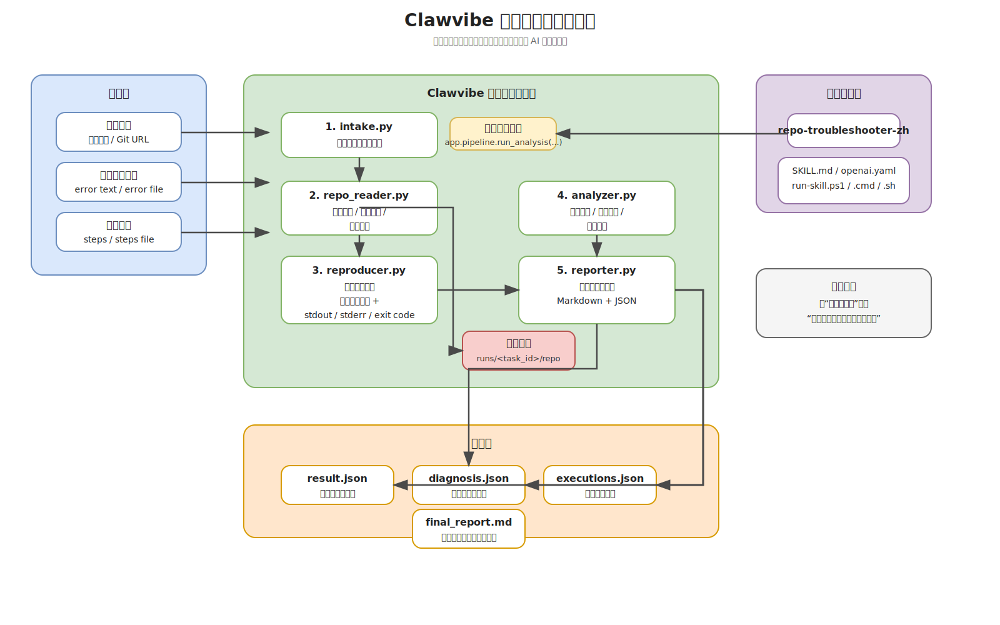
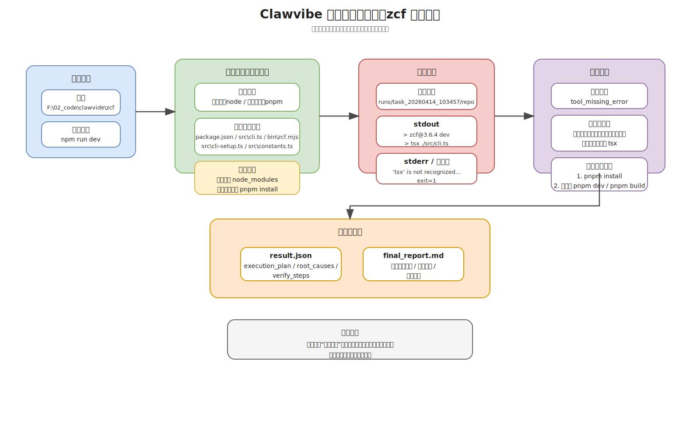

# Clawvibe

一个面向真实仓库场景的报错排障工具。它接收真实仓库、真实错误日志和真实复现步骤，在不直接修改源仓库的前提下，复制或克隆一个运行快照，执行命令，并输出结构化诊断结果。

## 项目定位

这个项目解决的是“看到了报错，但不知道该从哪里排查”的问题，尤其适合：

- 接手陌生仓库时快速建立上下文
- 把用户提供的失败步骤转成可回放的排障过程
- 同时产出适合人读的 Markdown 报告和适合程序消费的 JSON 结果
- 作为 Codex skill 封装，复用到其他工作流里

## 当前能力

- 支持输入本地仓库路径或远程 Git URL
- 必须提供错误日志和复现步骤
- 本地仓库会复制到 `runs/<task_id>/repo/` 下的快照目录执行
- 远程仓库会按需浅克隆到运行目录
- 自动扫描技术栈、依赖文件、配置文件、入口文件、测试命令和相关文件
- 根据复现步骤构建执行计划，并补充依赖安装或入口验证命令
- 实际执行命令并记录 stdout、stderr、返回码、超时状态
- 输出 `result.json`、`diagnosis.json`、`final_report.md` 等产物

## 工作流程

1. 读取输入：
   - `--repo` 指向本地仓库或远程 Git URL
   - `--error-log` / `--error-file` 提供原始报错
   - `--steps` / `--steps-file` 提供复现步骤
2. 创建任务目录 `runs/<task_id>/`
3. 准备仓库：
   - 本地仓库复制快照
   - 远程仓库执行浅克隆
4. 扫描仓库结构，识别：
   - 技术栈
   - 包管理器
   - 依赖文件
   - 配置文件
   - 入口点
   - 与报错或步骤相关的文件
5. 构建执行计划：
   - `user`：用户原始步骤中提取出的命令
   - `prerequisite`：依赖安装命令
   - `system`：入口验证命令
6. 执行计划并采集日志
7. 生成诊断结论和报告



## 目录结构

```text
app/
  analyzer.py      # 错误分类、根因推断、修复建议
  intake.py        # 输入读取与任务建模
  main.py          # CLI 入口
  models.py        # 数据模型
  pipeline.py      # 主流程编排
  repo_reader.py   # 仓库准备与结构扫描
  reproducer.py    # 执行计划构建与命令执行
  reporter.py      # JSON / Markdown 产物输出

skills/
  repo-troubleshooter-zh/

runs/              # 每次分析的输出目录
tmp/               # 临时目录
```

## 安装与运行

要求：

- Python 3.12+
- 本机具备目标仓库依赖的运行环境
- 如果输入远程仓库 URL，需要本机可用 `git`

可选安装：

```powershell
python -m pip install -e .
```

直接运行主程序：

```powershell
python -B app/main.py `
  --repo F:\path\to\repo `
  --error-file .\error.txt `
  --steps-file .\steps.txt `
  --json
```

或者使用安装后的命令：

```powershell
repo-claw --repo F:\path\to\repo --error-file .\error.txt --steps-file .\steps.txt --json
```

常用参数：

- `--repo`：本地仓库路径或远程 Git URL
- `--branch`：远程仓库分支
- `--error-log` / `--error-file`：错误日志
- `--steps` / `--steps-file`：复现步骤
- `--runs-dir`：输出目录根路径，默认是 `runs`
- `--timeout`：单条命令超时时间，默认 180 秒
- `--json`：将统一结果输出到 stdout

## 输入约束

当前实现会从复现步骤中提取可执行命令，默认只接受以下前缀：

- `python`
- `python3`
- `py`
- `node`
- `npm`
- `pnpm`
- `yarn`

同一次任务最多提取前 3 条符合规则的用户命令。系统还会根据仓库扫描结果补充依赖安装和入口验证命令。

## 输出内容

每次运行会生成 `runs/<task_id>/` 目录，典型结构如下：

```text
runs/
  task_20260415_120000/
    source_meta.json
    input.json
    repo/
    repo_summary.json
    executions.json
    diagnosis.json
    result.json
    final_report.md
```

各文件含义：

- `source_meta.json`：源仓库类型和本地环境检测结果
- `input.json`：本次任务输入
- `repo_summary.json`：仓库扫描摘要
- `executions.json`：执行记录
- `diagnosis.json`：诊断结果
- `result.json`：统一结构化输出
- `final_report.md`：面向人工阅读的报告



## Skill 说明

仓库内置一个 skill 包，基于同一条分析流水线对仓库报错进行排障：

### `repo-troubleshooter-zh`

中文 skill，适合中文场景下的仓库报错排障。技能名和目录名均为 `repo-troubleshooter-zh`。典型用途：

- 分析一个本地或远程仓库为什么启动失败
- 回放用户提供的失败命令
- 把真实报错整理成结构化诊断结果
- 不直接改动源仓库，只在快照副本里执行

入口：

- `skills/repo-troubleshooter-zh/scripts/analyze_repo.py`
- `skills/repo-troubleshooter-zh/scripts/run-skill.ps1`
- `skills/repo-troubleshooter-zh/scripts/run-skill.cmd`
- `skills/repo-troubleshooter-zh/scripts/run-skill.sh`

示例：

```powershell
.\skills\repo-troubleshooter-zh\scripts\run-skill.ps1 `
  --repo F:\path\to\repo `
  --error-file .\error.txt `
  --steps-file .\steps.txt
```


两者共同特点：

- 输入都要求仓库、错误日志、复现步骤
- 最终都会调用 `app.pipeline.run_analysis`
- 默认把运行产物写入仓库根目录下的 `runs/`
- 标准输出是完整 JSON 结果

## 适用边界

当前版本最适合：

- Python 仓库
- Node 仓库
- Python + Node 混合仓库
- 依赖缺失、路径错误、配置错误、权限问题、端口冲突等启动类问题

当前没有实现：

- 自动修改源仓库
- 自动生成补丁或提交 PR
- 更复杂的多轮交互式调试
- 面向大型单仓多应用场景的精细化执行编排

## License

MIT，见 [LICENSE](LICENSE)。
